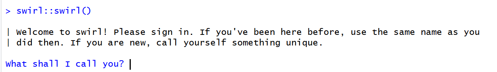
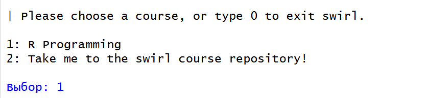

# Введение в R
nastya5908@yandex.ru

## Цель работы

1.  Развить практические навыки использования языка программирования R
    для обработки данных

2.  Развить навыки работы в Rstudio IDE:

    -   установка пакетов
    -   работа с проектами в Rstudio
    -   настройка и работа с Git

3.  Закрепить знания базовых типов данных языка R и простейших операций
    с ними

## Исходные данные

1.  Программное обеспечение Windows 11
2.  Rstudio Desktop
3.  Интерпретатор языка R 4.5.1

## План:

1.  Установить интерпретатор R, Rstudio IDE, программный пакет swirl

2.  Запустить задание, открыть курс и выполнить необходимые подкурсы

3.  Составить отчет и выложить его и исходный qmd/rmd файл в свой
    репозиторий

## Шаги

1.  Установим интерпретатор R <br><br> 

2.  Установим Rstudio IDE <br><br> 

3.  Установим программный пакет swirl<br><br>
    `install.packages("swirl")`

4.  Запустим задание с помощью swirl::swirl()<br><br> 

5.  Выберем из меню курсов: 1. R Programming: The basics of programming
    in R<br><br> 

6.  Выполним подкурсы:

### Basic Building Blocks

Вычислим сумму двух чисел:

``` r
5+7
```

    [1] 12

Запишем результат суммы чисел в переменную:

``` r
x <- 5+7
```

Выведем значение переменной х:

``` r
x
```

    [1] 12

Создадим переменную y и запишем в нее значение x-3

``` r
y <- x-3
```

Выведем значение переменной y:

``` r
y
```

    [1] 9

Cоздадим вектор со значениями (1.1, 9, 3.14) и запишем его в переменную
z:

``` r
z <- c(1.1, 9, 3.14)
```

Получим информацию о команде с:

``` r
?c
```

    запускаю httpd сервер помощи... готово

Получим значение переменной z:

``` r
z
```

    [1] 1.10 9.00 3.14

Создадим вектор со значениями (z, 555, z)

``` r
c(z, 555, z)
```

    [1]   1.10   9.00   3.14 555.00   1.10   9.00   3.14

Арифметические операции с вектором:

``` r
z*2+100
```

    [1] 102.20 118.00 106.28

Запишем результат выражения в переменную my_sqrt:

``` r
my_sqrt <- sqrt(z-1)
```

Выведем значение переменной my_sqrt:

``` r
my_sqrt
```

    [1] 0.3162278 2.8284271 1.4628739

Запишем результат выражения в переменную my_div:

``` r
my_div <- z/my_sqrt
```

Выведем значение переменной my_div:

``` r
my_div
```

    [1] 3.478505 3.181981 2.146460

Выполним сложения для двух векторов разной длины:

``` r
c(1,2,3,4) + c(0,10)
```

    [1]  1 12  3 14

``` r
c(1,2,3,4) + c(0,10, 100)
```

    Warning in c(1, 2, 3, 4) + c(0, 10, 100): длина большего объекта не является
    произведением длины меньшего объекта

    [1]   1  12 103   4

С помощью стрелки вверх можно вводить предыдущие команды и изменять их

``` r
z*2+1000
```

    [1] 1002.20 1018.00 1006.28

С помощью tab можно найти использованные переменные по первым символам

``` r
my_div
```

    [1] 3.478505 3.181981 2.146460

### Workspace and Files

Выведем текущую рабочую директорию:

``` r
getwd()
```

    [1] "D:/учеба/4 курс/threat hunting/1/threathunting"

Выведем список переменных:

``` r
ls()
```

    [1] "my_div"  "my_sqrt" "x"       "y"       "z"      

Запишем в переменную x значение 9 и выведем список переменных:

``` r
x <- 9
```

``` r
ls()
```

    [1] "my_div"  "my_sqrt" "x"       "y"       "z"      

Выведем список файлов в директории:

``` r
dir()
```

     [1] "img"                 "lab1.qmd"            "lab1.rmarkdown"     
     [4] "mytest2.R"           "mytest3.R"           "README.html"        
     [7] "README.md"           "testdir"             "testdir2"           
    [10] "threathunting.Rproj"

Получим справку по команде:

``` r
?list.files
```

Посмотрим список возможных аргументов функции:

``` r
args(list.files)
```

    function (path = ".", pattern = NULL, all.files = FALSE, full.names = FALSE, 
        recursive = FALSE, ignore.case = FALSE, include.dirs = FALSE, 
        no.. = FALSE) 
    NULL

Запишем текущую рабочую директорию в переменную old.dir:

``` r
old.dir <- getwd()
```

Создадим директорию testdir и перейдем в нее:

``` r
dir.create("testdir")
```

    Warning in dir.create("testdir"): 'testdir' уже существует

``` r
setwd("testdir")
```

Создадим файл mytest.R:

``` r
file.create("mytest.R")
```

    [1] TRUE

Выведем список файлов в директории:

``` r
list.files()
```

     [1] "img"                 "lab1.qmd"            "lab1.rmarkdown"     
     [4] "mytest.R"            "mytest2.R"           "mytest3.R"          
     [7] "README.html"         "README.md"           "testdir"            
    [10] "testdir2"            "threathunting.Rproj"

Проверим существование файла:

``` r
file.exists("mytest.R")
```

    [1] TRUE

Посмотрим информацию о файле:

``` r
file.info("mytest.R")
```

             size isdir mode               mtime               ctime
    mytest.R    0 FALSE  666 2025-10-15 14:29:39 2025-10-15 14:29:39
                           atime exe uname         udomain
    mytest.R 2025-10-15 14:29:39  no nasty LAPTOP-JVMBKB5C

Переименуем файл mytest.R в mytest2.R

``` r
file.rename("mytest.R","mytest2.R")
```

    [1] TRUE

Скопируем файл:

``` r
file.copy("mytest2.R","mytest3.R")
```

    [1] FALSE

Укажем относительный путь к файлу:

``` r
file.path("mytest3.R")
```

    [1] "mytest3.R"

Создадим пути к папкам folder1 и folder2:

``` r
file.path("folder1", "folder2")
```

    [1] "folder1/folder2"

Создадим вложенные папки:

``` r
dir.create(file.path("testdir2", "testdir3"), recursive = TRUE)
```

    Warning in dir.create(file.path("testdir2", "testdir3"), recursive = TRUE):
    'testdir2\testdir3' уже существует

Вернемся в начальную директорию

``` r
setwd(old.dir)
```

### Sequences of Numbers

Создадим последовательность чисел от 1 до 20:

``` r
1:20
```

     [1]  1  2  3  4  5  6  7  8  9 10 11 12 13 14 15 16 17 18 19 20

Создадим последовательность дробных чисел от п до 10:

``` r
pi:10
```

    [1] 3.141593 4.141593 5.141593 6.141593 7.141593 8.141593 9.141593

Создадим последовательность чисел от 15 до 1:

``` r
15:1
```

     [1] 15 14 13 12 11 10  9  8  7  6  5  4  3  2  1

Посмотрим документацию по команде:

``` r
?':'
```

Создадим последовательность чисел от 1 до 20 с помощью seq:

``` r
seq(1,20)
```

     [1]  1  2  3  4  5  6  7  8  9 10 11 12 13 14 15 16 17 18 19 20

Создадим последовательность чисел от 1 до 20 с шагом 0.5 с помощью seq :

``` r
seq(0,10,by=0.5)
```

     [1]  0.0  0.5  1.0  1.5  2.0  2.5  3.0  3.5  4.0  4.5  5.0  5.5  6.0  6.5  7.0
    [16]  7.5  8.0  8.5  9.0  9.5 10.0

Создадим последовательность чисел от 1 до 10 длиной 30 с помощью seq :

``` r
seq(5, 10, length=30)
```

     [1]  5.000000  5.172414  5.344828  5.517241  5.689655  5.862069  6.034483
     [8]  6.206897  6.379310  6.551724  6.724138  6.896552  7.068966  7.241379
    [15]  7.413793  7.586207  7.758621  7.931034  8.103448  8.275862  8.448276
    [22]  8.620690  8.793103  8.965517  9.137931  9.310345  9.482759  9.655172
    [29]  9.827586 10.000000

Запишем результат в переменную my_seq:

``` r
my_seq <- seq(5, 10, length=30)
```

Посмотрим длину переменной:

``` r
length(my_seq)
```

    [1] 30

Создадим последовательность чисел от 1 до длины переменной my_seq
разными способами:

``` r
1:length(my_seq)
```

     [1]  1  2  3  4  5  6  7  8  9 10 11 12 13 14 15 16 17 18 19 20 21 22 23 24 25
    [26] 26 27 28 29 30

``` r
seq(along.with = my_seq)
```

     [1]  1  2  3  4  5  6  7  8  9 10 11 12 13 14 15 16 17 18 19 20 21 22 23 24 25
    [26] 26 27 28 29 30

``` r
seq_along(my_seq)
```

     [1]  1  2  3  4  5  6  7  8  9 10 11 12 13 14 15 16 17 18 19 20 21 22 23 24 25
    [26] 26 27 28 29 30

Создадим вектор, состоящий из 40 нулей:

``` r
rep(0,times=40)
```

     [1] 0 0 0 0 0 0 0 0 0 0 0 0 0 0 0 0 0 0 0 0 0 0 0 0 0 0 0 0 0 0 0 0 0 0 0 0 0 0
    [39] 0 0

Создадим вектор, содержащий вектор c(0, 1, 2) 10 раз:

``` r
rep(c(0, 1, 2), times = 10)
```

     [1] 0 1 2 0 1 2 0 1 2 0 1 2 0 1 2 0 1 2 0 1 2 0 1 2 0 1 2 0 1 2

Создадим вектор, содержащий каждое значение вектора c(0, 1, 2) 10 раз:

``` r
rep(c(0, 1, 2), each = 10)
```

     [1] 0 0 0 0 0 0 0 0 0 0 1 1 1 1 1 1 1 1 1 1 2 2 2 2 2 2 2 2 2 2

### Vectors

Создадим вектор со значениями 0.5, 55, -10, 6 и запишем его в переменную
num_vect:

``` r
num_vect <- c(0.5, 55, -10, 6)
```

Запишем в переменную tf результат выражения num_vect \< 1:

``` r
tf <- num_vect < 1
```

Выведем значение переменной tf:

``` r
tf
```

    [1]  TRUE FALSE  TRUE FALSE

Логическое выражение:

``` r
num_vect >= 6
```

    [1] FALSE  TRUE FALSE  TRUE

Создадим вектор из строк и запишем его в переменную:

``` r
my_char <- c("My", "name", "is")
```

Выведем значение переменной my_char:

``` r
my_char
```

    [1] "My"   "name" "is"  

Объединим значения вектора в одно:

``` r
paste(my_char, collapse = " ")
```

    [1] "My name is"

Добавим к переменной my_char значение и запишем это в переменную
my_name:

``` r
my_name <- c(my_char, "Nastya")
```

``` r
my_name
```

    [1] "My"     "name"   "is"     "Nastya"

Объединим значения вектора в одно:

``` r
paste(my_name, collapse = " ")
```

    [1] "My name is Nastya"

Соединим две строки:

``` r
paste("Hello", "world!", sep = " ")
```

    [1] "Hello world!"

Соединим два вектора:

``` r
paste(1:3, c("X","Y","Z"), sep = "")
```

    [1] "1X" "2Y" "3Z"

Соединим два вектора разной длины:

``` r
paste(LETTERS, 1:4, sep = "-")
```

     [1] "A-1" "B-2" "C-3" "D-4" "E-1" "F-2" "G-3" "H-4" "I-1" "J-2" "K-3" "L-4"
    [13] "M-1" "N-2" "O-3" "P-4" "Q-1" "R-2" "S-3" "T-4" "U-1" "V-2" "W-3" "X-4"
    [25] "Y-1" "Z-2"

### Missing Values

Запишем в переменную x вектор с пропущенными значениями:

``` r
x <- c(44, NA, 5, NA)
```

Умножим х на 3:

``` r
x*3
```

    [1] 132  NA  15  NA

Запишем в переменную y вектор из 1000 случайных значений нормального
распределения:

``` r
y <- rnorm(1000)
```

Запишем в переменную y вектор из 1000 значений NA:

``` r
z <- rep(NA, 1000)
```

Запишем в переменную my_data 100 случайных значений из переменных y и z:

``` r
my_data <- sample(c(y,z),100)
```

Запишем в переменную my_na результат проверки:

``` r
my_na <- is.na(my_data)
```

``` r
my_na
```

      [1]  TRUE FALSE FALSE FALSE  TRUE  TRUE FALSE FALSE  TRUE FALSE FALSE FALSE
     [13]  TRUE FALSE FALSE FALSE FALSE FALSE  TRUE FALSE FALSE FALSE  TRUE  TRUE
     [25] FALSE FALSE FALSE FALSE  TRUE  TRUE  TRUE  TRUE FALSE FALSE FALSE  TRUE
     [37]  TRUE  TRUE  TRUE  TRUE  TRUE FALSE FALSE  TRUE FALSE FALSE  TRUE  TRUE
     [49]  TRUE  TRUE FALSE FALSE  TRUE  TRUE  TRUE  TRUE FALSE  TRUE FALSE FALSE
     [61] FALSE  TRUE  TRUE  TRUE  TRUE  TRUE  TRUE FALSE FALSE  TRUE FALSE FALSE
     [73] FALSE  TRUE FALSE  TRUE  TRUE  TRUE FALSE  TRUE FALSE  TRUE FALSE FALSE
     [85]  TRUE FALSE  TRUE FALSE FALSE  TRUE  TRUE FALSE FALSE FALSE  TRUE FALSE
     [97] FALSE FALSE  TRUE FALSE

Сравним значения переменной с NA:

``` r
my_data == NA
```

      [1] NA NA NA NA NA NA NA NA NA NA NA NA NA NA NA NA NA NA NA NA NA NA NA NA NA
     [26] NA NA NA NA NA NA NA NA NA NA NA NA NA NA NA NA NA NA NA NA NA NA NA NA NA
     [51] NA NA NA NA NA NA NA NA NA NA NA NA NA NA NA NA NA NA NA NA NA NA NA NA NA
     [76] NA NA NA NA NA NA NA NA NA NA NA NA NA NA NA NA NA NA NA NA NA NA NA NA NA

Посчитаем количество TRUE в my_na:

``` r
sum(my_na)
```

    [1] 47

Выведем значения my_data:

``` r
my_data
```

      [1]          NA -1.21020382  0.22108960  0.34806572          NA          NA
      [7] -2.78403543  1.21005590          NA  0.62800702  1.57068794 -2.39033387
     [13]          NA  0.03482036  0.22014009 -1.32731846 -1.48656191  0.59588333
     [19]          NA -0.48380262 -1.10874580  1.50371876          NA          NA
     [25] -1.07843971  2.05824646  0.85264200 -2.34932618          NA          NA
     [31]          NA          NA  0.57198121 -1.19839681 -0.36977044          NA
     [37]          NA          NA          NA          NA          NA -2.48532624
     [43] -0.08181187          NA  0.09230907  2.83234089          NA          NA
     [49]          NA          NA -1.08355297 -1.52896323          NA          NA
     [55]          NA          NA -0.36662743          NA -0.49699027  1.20243563
     [61] -0.19151159          NA          NA          NA          NA          NA
     [67]          NA  0.74426060  0.41880483          NA  0.08766195  0.10201240
     [73] -0.56925531          NA  1.08817588          NA          NA          NA
     [79]  0.83757543          NA  0.01424996          NA  1.33880994  0.20032997
     [85]          NA  0.35438279          NA  0.03135374  0.50130410          NA
     [91]          NA  0.27762853  0.43595327 -1.22764008          NA  0.27341872
     [97] -1.03606905  0.88570049          NA -1.31809491

Еще один тип пропущенных значений:

``` r
0/0
```

    [1] NaN

``` r
Inf - Inf
```

    [1] NaN

## Вывод

При выполнении работы были получены навыки использования языка
программирования R и работы в RStudio IDE.
