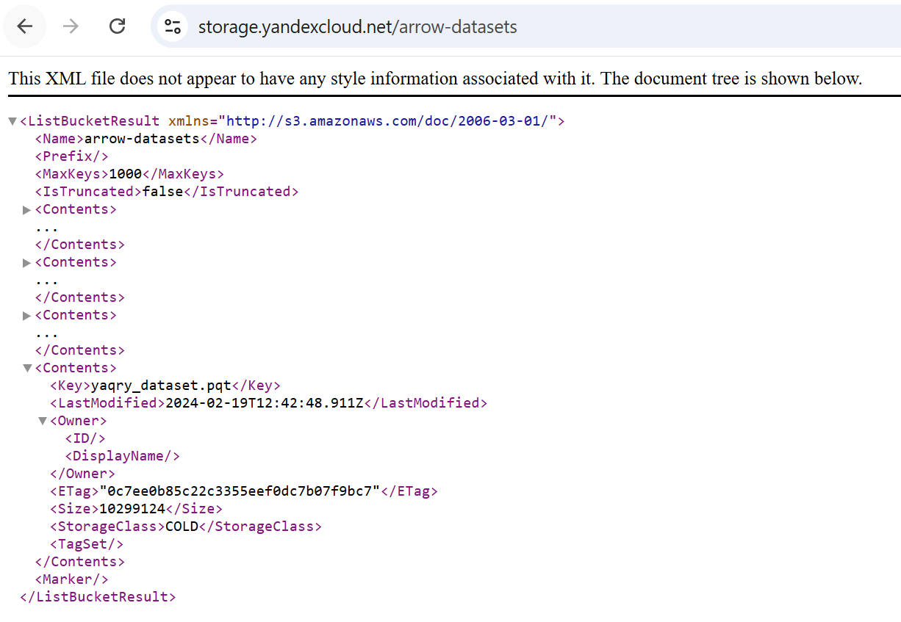
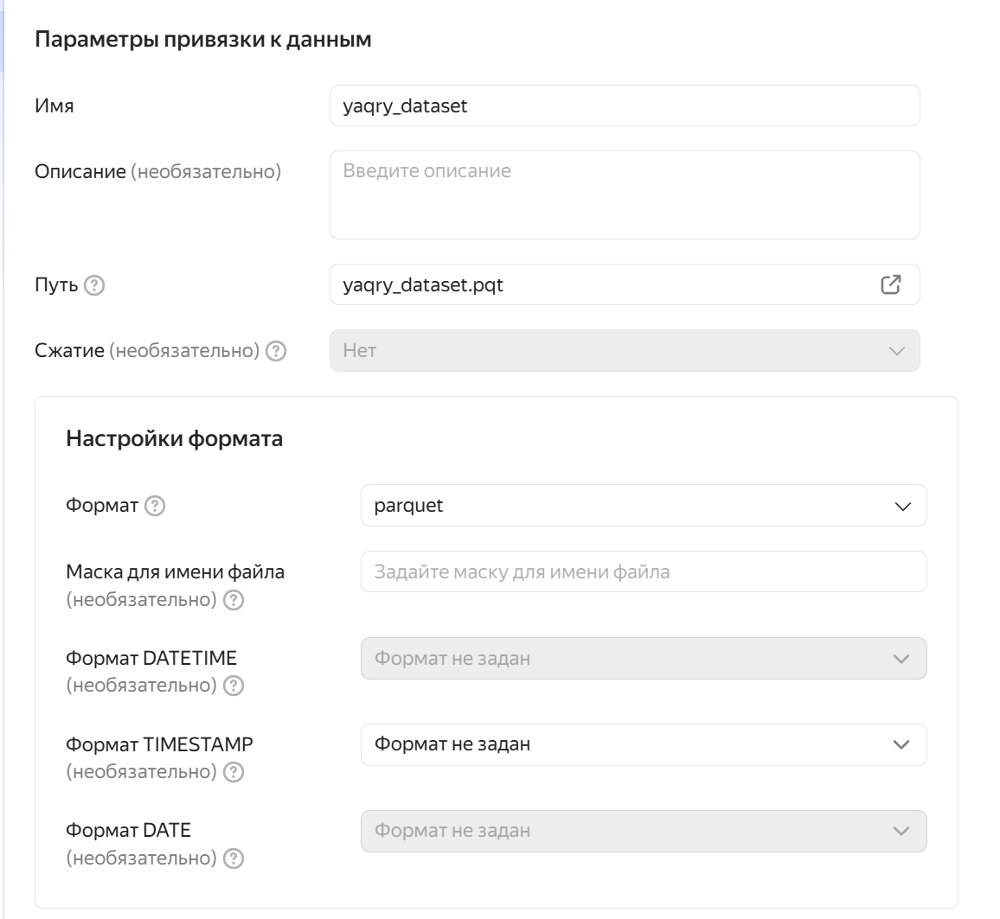
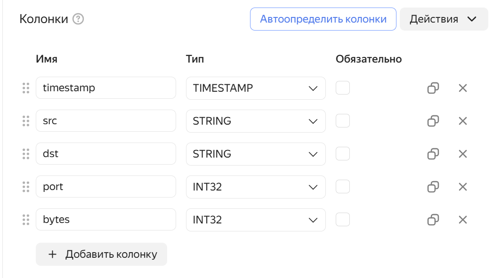
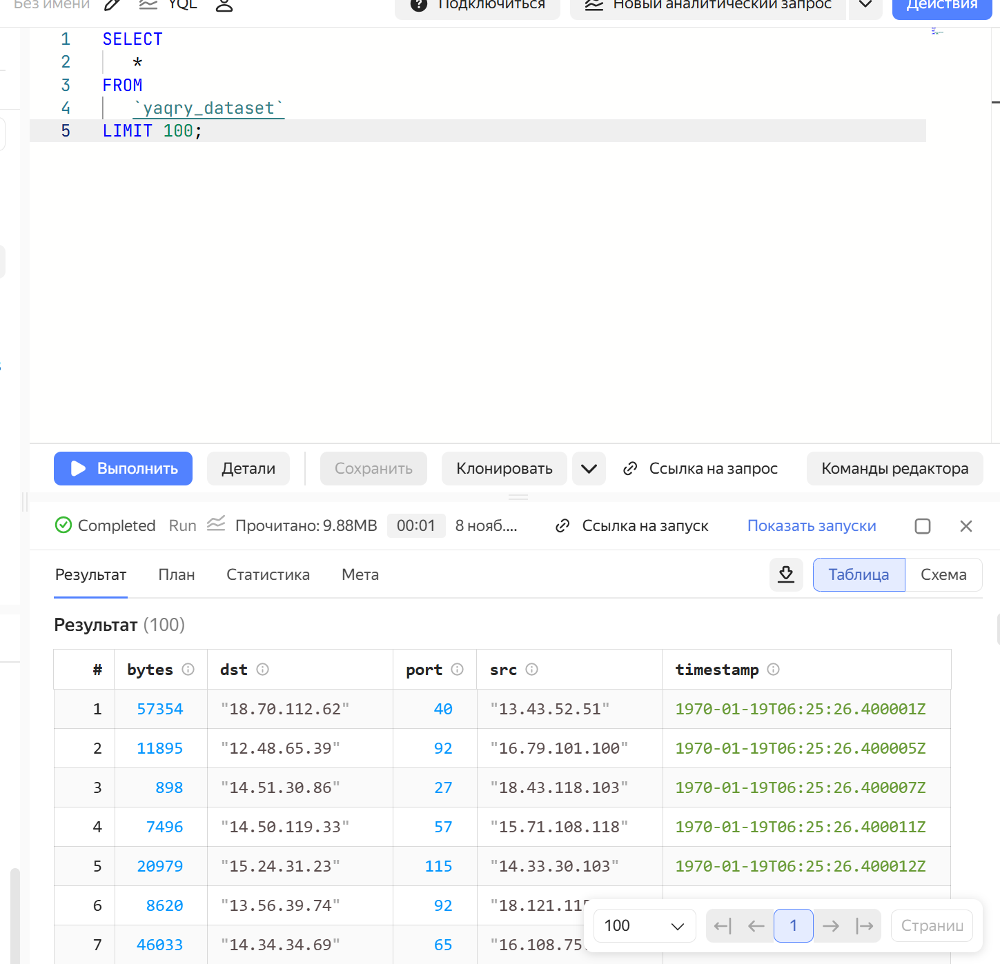
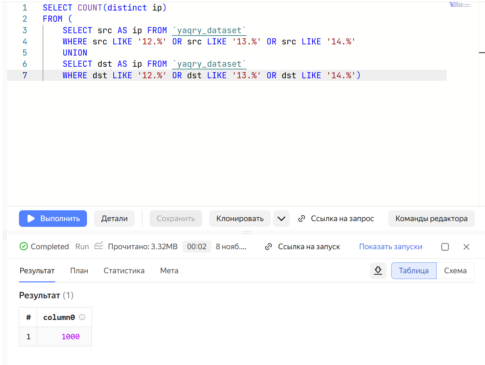
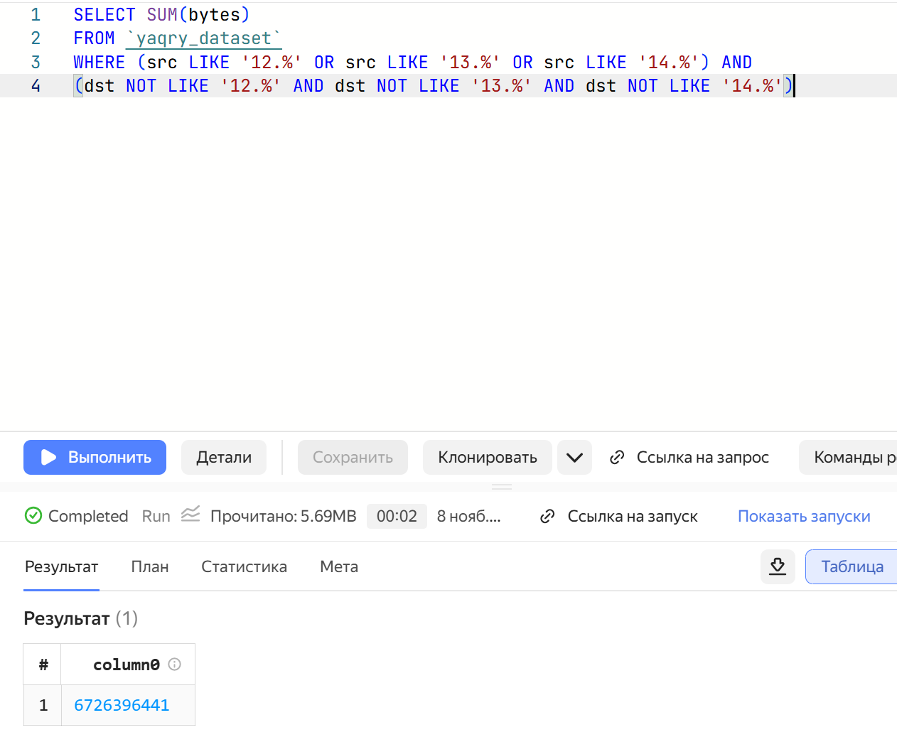
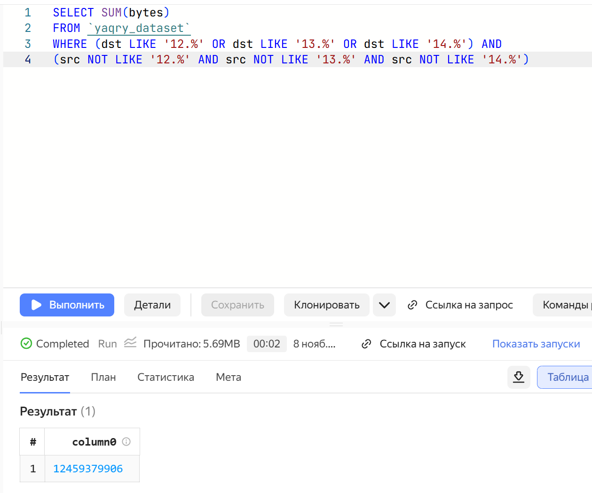

# Использование технологии Yandex Query для анализа данных сетевой активности
nastya5908@yandex.ru

## Цель работы

1.  Изучить возможности технологии Yandex Query для анализа
    структурированных наборов данных
2.  Получить навыки построения аналитического пайплайна для анализа
    данных с помощью сервисов Yandex Cloud
3.  Закрепить практические навыки использования SQL для анализа данных
    сетевой активности в сегментированной корпоративной сети

## Исходные данные

1.  Файл yaqry_dataset.pqt в бакете arrow-datasets S3 хранилища Yandex
    Object Storage
2.  Облачное решение для анализа данных Yandex Query

## План:

1.  Проверить доступность данных в Yandex Object Storage
2.  Подключить бакет как источник данных для Yandex Query
3.  Проанализировать данные и выполнить задания

## Шаги

1.  Проверим доступность данных (файл yaqry_dataset.pqt) в бакете
    arrow-datasets S3 хранилища Yandex Object Storage 
    Данные доступны

#### Подключим бакет как источник данных для Yandex Query

1.  Создадим соединение для бакета S3 в хранилище 
2.  Сделаем привязку данных 
3.  Настроим привязку данных 
4.  Проверим привязку данных - сделаем аналитический запрос для вывода
    первых 100 строк

<!-- -->

    SELECT * FROM `yaqry_dataset`
    LIMIT 100;

#### Решим задания:

1.  Известно, что IP адреса внутренней сети начинаются с октетов,
    принадлежащих интервалу 12-14. Определите количество хостов
    внутренней сети, представленных в датасете.

<!-- -->

    SELECT COUNT(distinct ip)
    FROM (
        SELECT src AS ip FROM `yaqry_dataset` 
        WHERE src LIKE '12.%' OR src LIKE '13.%' OR src LIKE '14.%'
        UNION
        SELECT dst AS ip FROM `yaqry_dataset`
        WHERE dst LIKE '12.%' OR dst LIKE '13.%' OR dst LIKE '14.%')

 2. Определите суммарный объем исходящего трафика

    SELECT SUM(bytes)
    FROM `yaqry_dataset`
    WHERE src LIKE '12.%' OR src LIKE '13.%' OR src LIKE '14.%';

 3. Определите суммарный объем входящего трафика

    SELECT SUM(bytes)
    FROM `yaqry_dataset`
    WHERE dst LIKE '12.%' OR src LIKE '13.%' OR src LIKE '14.%';

## Вывод

При выполнении работы были изучены технологии Yandex Query для анализа
структурированных наборов данных, получены навыки для построения
аналитического пайплайна для анализа данных с помощью сервисов Yandex
Cloud и закреплены практические навыки использования SQL для анализа
данных сетевой активности в сегментированной корпоративной сети
