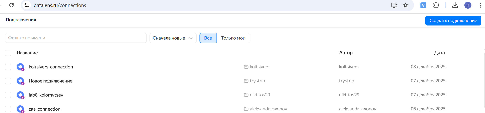
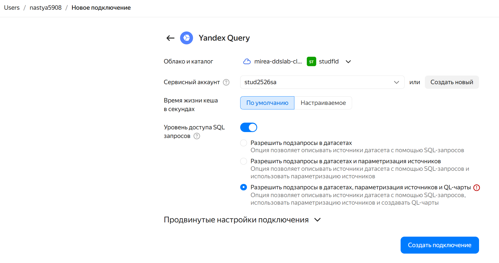
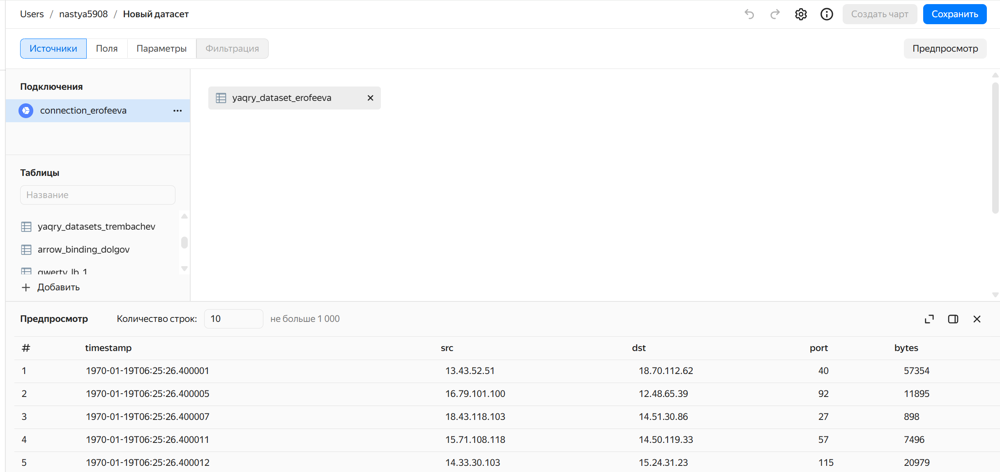
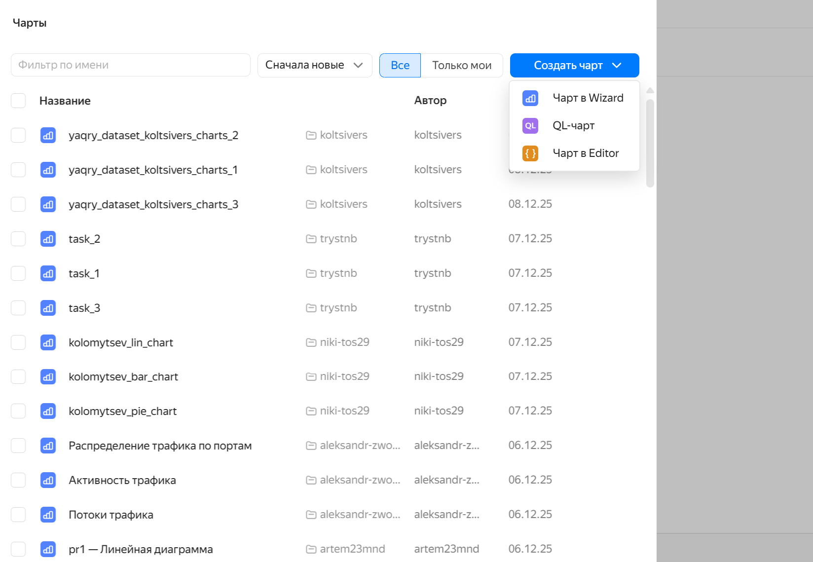
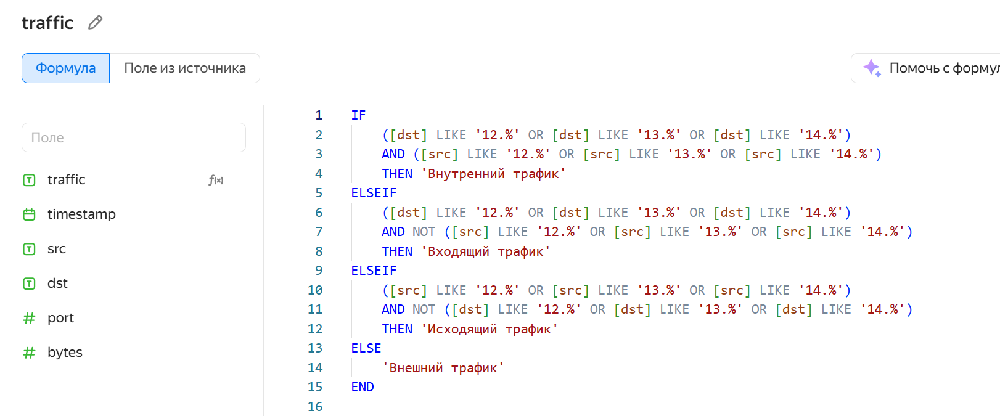
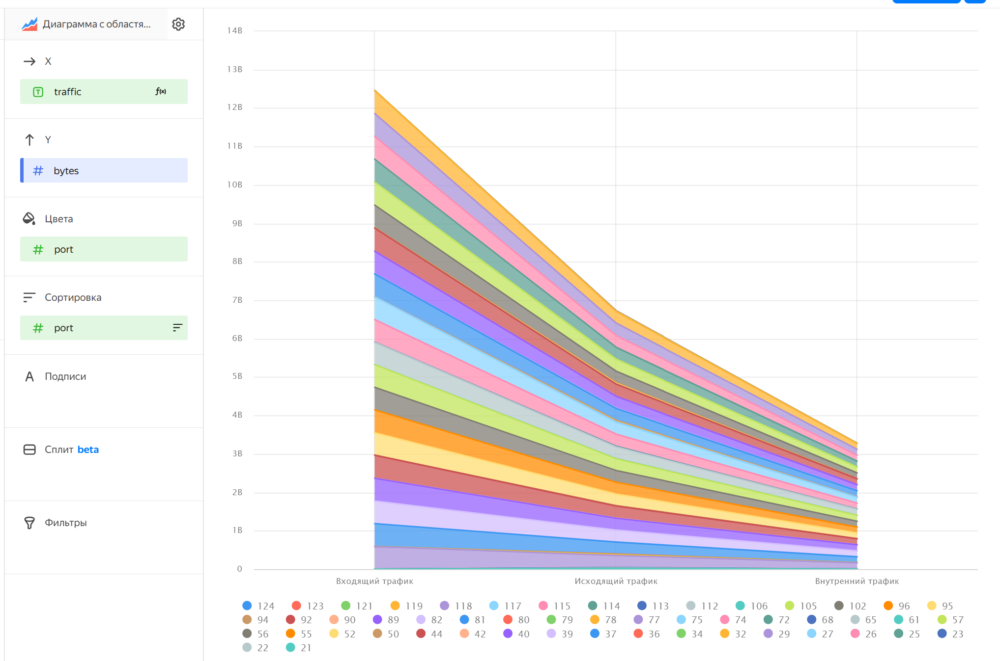
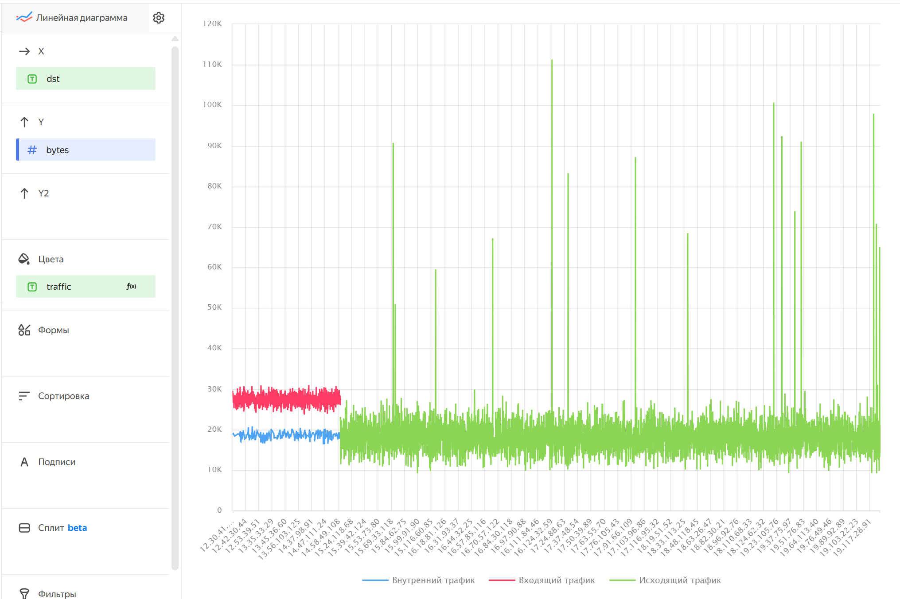
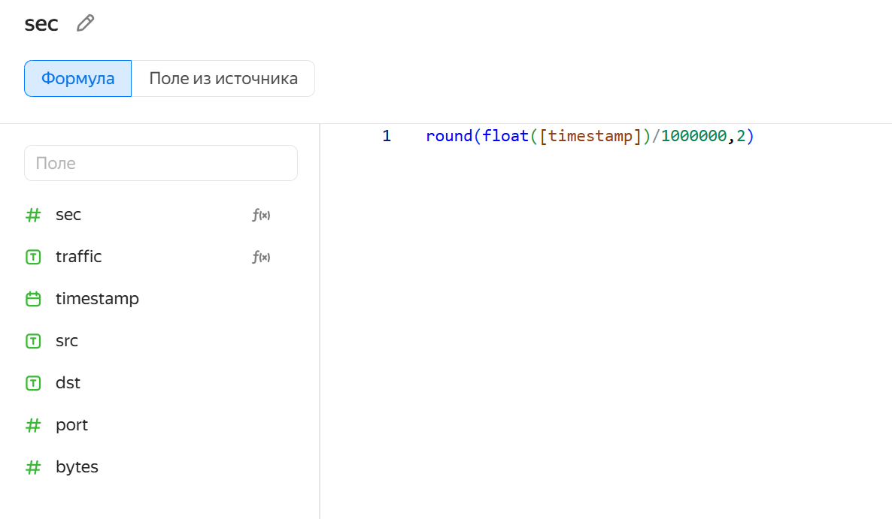
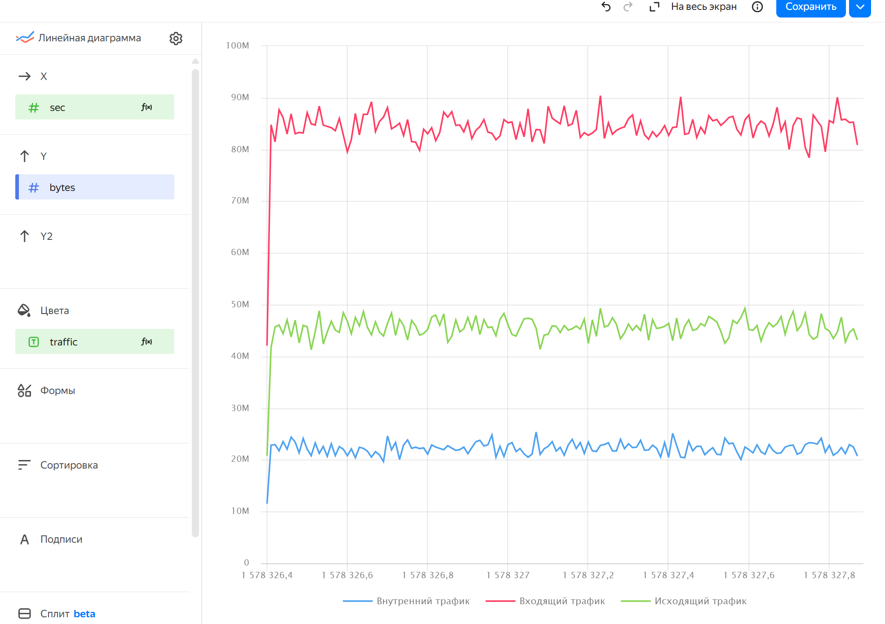
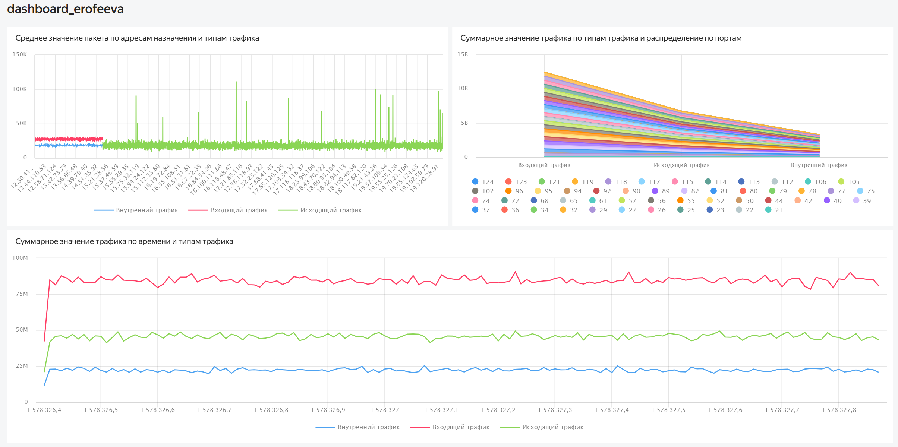

# Использование технологии Yandex DataLens для анализа данных сетевой
активности
nastya5908@yandex.ru

## Цель работы

1.  Изучить возможности технологии Yandex DataLens для визуального
    анализа структурированных наборов данных
2.  Получить навыки визуализации данных для последующего анализа с
    помощью сервисов Yandex Cloud
3.  Получить навыки создания решений мониторинга/SIEM на базе облачных
    продуктов и открытых программных решений
4.  Закрепить практические навыки использования SQL для анализа данных
    сетевой активности в сегментированной корпоративной сети

## Исходные данные

1.  Сервис Yandex DataLens
2.  Облачное решение для анализа данных Yandex Query

## План:

1.  Подключиться к Yandex Query из Yandex DataLens
2.  Создать необходимые графики и диаграммы
3.  Создать дашборд
4.  Составить отчет и выложить его и исходный qmd/rmd файл в свой
    репозиторий

## Шаги

``` r
sessionInfo()
```

    R version 4.5.1 (2025-06-13 ucrt)
    Platform: x86_64-w64-mingw32/x64
    Running under: Windows 11 x64 (build 26200)

    Matrix products: default
      LAPACK version 3.12.1

    locale:
    [1] LC_COLLATE=Russian_Russia.utf8  LC_CTYPE=Russian_Russia.utf8   
    [3] LC_MONETARY=Russian_Russia.utf8 LC_NUMERIC=C                   
    [5] LC_TIME=Russian_Russia.utf8    

    time zone: Europe/Moscow
    tzcode source: internal

    attached base packages:
    [1] stats     graphics  grDevices utils     datasets  methods   base     

    loaded via a namespace (and not attached):
     [1] compiler_4.5.1    fastmap_1.2.0     cli_3.6.5         tools_4.5.1      
     [5] htmltools_0.5.8.1 rstudioapi_0.17.1 yaml_2.3.10       rmarkdown_2.29   
     [9] knitr_1.50        jsonlite_2.0.0    xfun_0.53         digest_0.6.37    
    [13] rlang_1.1.6       evaluate_1.0.5   

1\. Настроить подключение к Yandex Query из DataLens Откроем DataLens,
зайдем в раздел подключения 

Создаем новое подключение  2. Создать из запроса
YandexQuery датасет DataLens



3\. Создать нужные графики и диаграммы

Создадим новый чарт 

Добавим новую переменную - определим тип трафика 

Диаграмма распределения суммарного трафика по типам и портам


Линейная сравнительная диаграмма среднено значения пакета на адреса
назначения с указанием типа трафика 

Добавим переменную - количество секунд, прошедшее с начала отсчета,
округленное до двух знаков после запятой  Линейная
сравнительная диаграмма суммарного трафика по времени с указанием типа
трафика 

4\. Создать дашборд  [Ссылка на итоговый
дашборд](https://datalens.ru/p9q9nw5360qga)

## Вывод

При выполнении работы были изучены технологии Yandex DataLens для
визуального анализа структурированных наборов данных, получены навыки
визуализации данных с помощью сервисов Yandex Cloud и закреплены
практические навыки использования SQL для анализа данных сетевой
активности в сегментированной корпоративной сети
